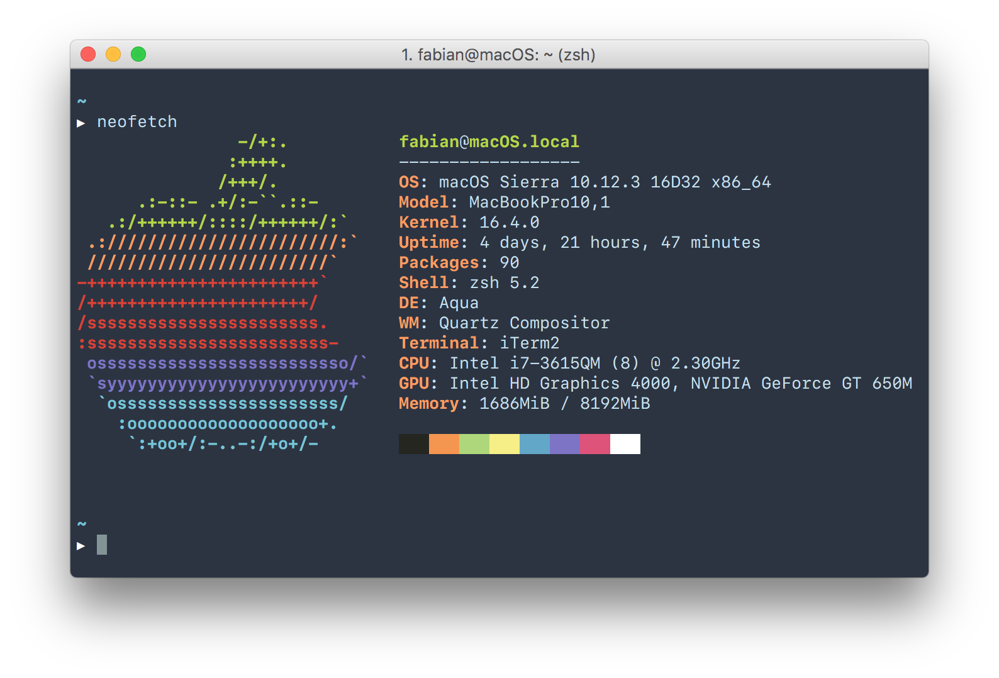

# Fabians Dotfiles



My macOS dotfiles. Originally forked from [klaemo/dotfiles](https://github.com/klaemo/dotfiles).

## How to install

The installation step may overwrite existing dotfiles in your HOME directory.

```bash
$ git clone https://github.com/sto3psl/dotfiles.git .dotfiles && cd .dotfiles && ./bootstrap.sh
```

**All of the following scripts assume you are in the `.dotfiles` directory.**

## How to update

Run the bootstrap script:

```bash
$ ./bootstrap.sh
```

## Features

### Homebrew software installation

Homebrew formulae:

```bash
$ ./brew.sh
```

* bash (latest version)
* [bash-completion](http://bash-completion.alioth.debian.org/)
* [ffmpeg](http://ffmpeg.org/)
* [git](http://git-scm.com/)
* [graphicsmagick](http://www.graphicsmagick.org/)
* [httpie](https://httpie.org)
* [hub](https://github.com/github/hub)
* [rsync](https://rsync.samba.org/) (latest version, rather than the out-dated OS X installation)
* [neofetch](https://github.com/dylanaraps/neofetch)
* ssh-copy-id
* [tree](http://mama.indstate.edu/users/ice/tree/)
* [watchman](https://facebook.github.io/watchman/)
* [wget](http://www.gnu.org/software/wget/)

Also newer versions of `grep`, `screen` and `openssh`.
`hub` (if it exists) will be aliased as `git`.

### New Mac setup 

```bash
$ ./setup.sh
```

* installs `oh-my-zsh` and changes default shell to `zsh`
* installs `nvm` and latest `node`
* installs `yarn`
* sets up *pure prompt* for `zsh`

* installs following software
  * [betterzipql](https://github.com/sindresorhus/quick-look-plugins)
  * [cyberduck](https://cyberduck.io)
  * [github-desktop](https://desktop.github.com)
  * [google-chrome](https://www.google.de/chrome/browser/desktop/)
  * [handbrake](https://handbrake.fr)
  * [imageoptim](https://imageoptim.com/mac)
  * [iterm2](https://www.iterm2.com)
  * [private-internet-access](https://deu.privateinternetaccess.com/pages/downloads)
  * [qlcolorcode](https://github.com/sindresorhus/quick-look-plugins)
  * [qlimagesize](https://github.com/sindresorhus/quick-look-plugins)
  * [qlmarkdown](https://github.com/sindresorhus/quick-look-plugins)
  * [qlprettypatch](https://github.com/sindresorhus/quick-look-plugins)
  * [qlstephen](https://github.com/sindresorhus/quick-look-plugins)
  * [quicklook-csv](https://github.com/sindresorhus/quick-look-plugins)
  * [quicklook-json](https://github.com/sindresorhus/quick-look-plugins)
  * [skype](https://www.skype.com/de/)
  * [slack](https://slack.com)
  * [spectacle](https://www.spectacleapp.com)
  * [sublime-text](https://www.sublimetext.com)
  * [suspicious-package](https://github.com/sindresorhus/quick-look-plugins)
  * [transmission](https://transmissionbt.com)
  * [visual-studio-code](https://code.visualstudio.com)
  * [vlc](http://www.videolan.org/vlc/)
  * [webpquicklook](https://github.com/sindresorhus/quick-look-plugins)

### Custom macOS defaults

```bash
$ ./.macos
```

## Acknowledgements

Inspiration and code was taken from many sources, including:

* [@necolas](https://github.com/necolas) (Nicolas Gallagher)
  [https://github.com/necolas/dotfiles](https://github.com/necolas/dotfiles)
* [@mathiasbynens](https://github.com/mathiasbynens) (Mathias Bynens)
  [https://github.com/mathiasbynens/dotfiles](https://github.com/mathiasbynens/dotfiles)
* [@hukl](https://github.com/hukl) (hukl)
  [https://github.com/hukl/dotfiles](https://github.com/hukl/dotfiles)
* [@klaemo](https://github.com/klaemo) (klaemo)
  [https://github.com/klaemo/dotfiles](https://github.com/klaemo/dotfiles)
